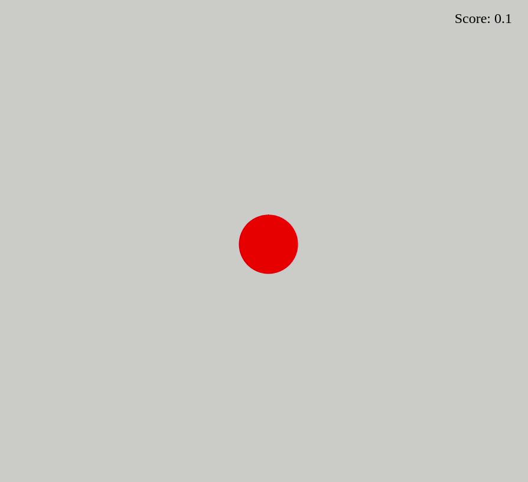

# Red-ball game ⚾
A simple game made using object-oriented programming. 
## Preview 👀


## About 🔎
This is an object-oriented programming aplication wich you can control a ball to avoid collisions.
### Implemented features ✅
- [x] Control of the ball by mouse 
- [x] Enemy balls
- [x] Friendly balls

### Future improvements 🔮
- [ ] Refactor code
- [ ] Change of the shape of the balls to something funny

## How to run

1. Clone this repository
2. Install dependencies
```bash
npm i
```
3. Run with double click on index.html
4. Finally access http://localhost:3000 on your favorite browser 
